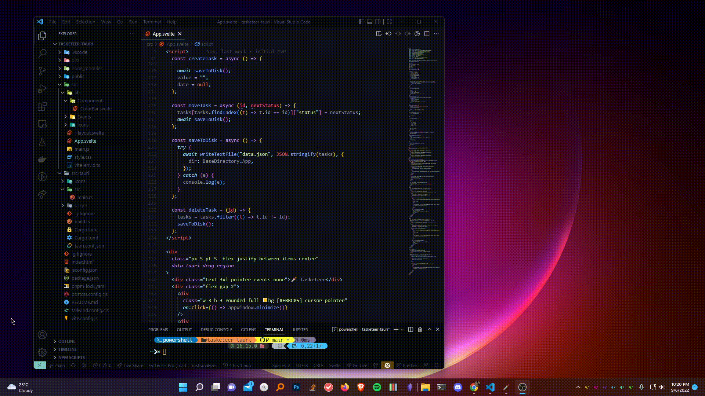

<h1 align="center">
  
</h1>

  <h1>Tasketeer</h1>
  <h3>A no-BS, lightweight task app. No fancy, useless features.</h3>
  

## Download

Get the latest release from [here](https://github.com/notnavindu/tasketeer-tauri/releases/)

## Features

- Manage tasks. nothing more. nothing less
- Lightweight

Made with Tauri + Svelte

